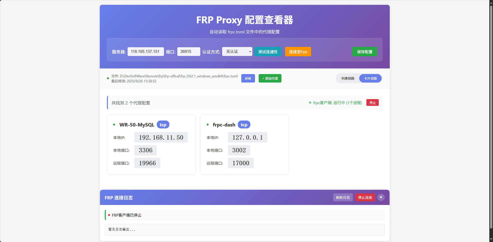
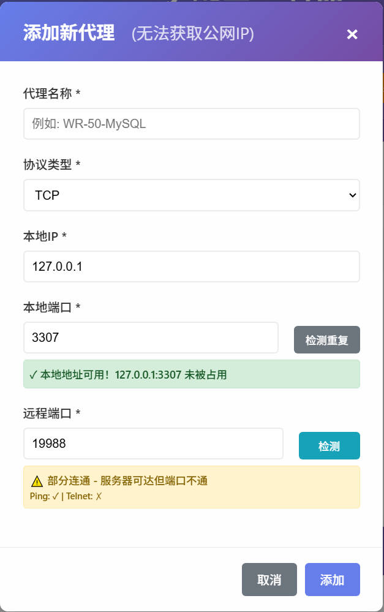

# FRP Dashboard - FRP 可视化管理面板

一个现代化的 Web 管理面板，用于管理 FRP (Fast Reverse Proxy) 客户端配置，支持实时监控和控制功能。


## 功能特性

### 核心功能
- 📊 **可视化代理管理** - 直观的界面查看和管理所有 FRP 代理配置
- ➕ **添加/编辑/删除代理** - 完整的代理配置增删改查操作
- 🔄 **实时状态监控** - 每 5 秒自动检查 FRP 客户端状态
- 📝 **实时日志显示** - 实时查看 FRP 客户端运行日志
- 🎨 **双视图模式** - 支持卡片视图和列表视图切换

### 高级功能
- 🔌 **连接管理** - 直接从面板启动/停止 FRP 客户端
- 🌐 **服务器配置** - 在线编辑 FRP 服务器设置（IP、端口、认证）
- 🔍 **连通性测试** - 保存前测试服务器连通性（ping 和 telnet）
- 🚫 **重复检测** - 自动验证防止重复的代理配置
- 🌍 **公网 IP 显示** - 显示本地机器的公网 IP，方便参考
- 🔐 **认证支持** - 支持 token 认证和无认证模式

## 界面截图

### 主界面

*卡片视图展示所有代理配置，顶部显示服务器连接信息和 FRP 客户端状态*

### 添加代理

*添加新代理时自动显示公网 IP，支持连通性测试*

### 实时日志

*连接到 FRP 服务器时实时显示日志信息*

### 服务器配置

*直接在页面顶部编辑服务器配置，支持测试连通性*

### 列表视图

*列表模式更紧凑地显示所有代理信息*

## 安装使用

### 环境要求
- Node.js (v14.0.0 或更高版本)
- Windows 操作系统
- FRP 客户端程序（`frpc.exe`）

### 快速开始

1. **克隆仓库**
```bash
git clone https://github.com/yourusername/frp-dashboard.git
cd frp-dashboard
```

2. **安装依赖**
```bash
npm install
```

3. **配置 FRP 路径**
编辑 `server.js`，更新 TOML 文件路径：
```javascript
const TOML_FILE_PATH = 'D:\\path\\to\\your\\frpc.toml';
```

4. **启动服务**
```bash
npm start
```

5. **访问面板**
打开浏览器访问：
```
http://localhost:3001
```

## 配置说明

### 服务器配置
默认运行在 3001 端口，可在 `server.js` 中修改：
```javascript
const PORT = 3001; // 修改为你需要的端口
```

### FRP 配置文件
面板读取和管理 `frpc.toml` 文件，示例配置：
```toml
serverAddr = "你的服务器IP"
serverPort = 7000

[[proxies]]
name = "web服务"
type = "tcp"
localIP = "127.0.0.1"
localPort = 80
remotePort = 8080
```

## API 接口

| 方法 | 端点 | 说明 |
|------|------|------|
| GET | `/api/proxies` | 获取所有代理配置 |
| POST | `/api/proxies` | 添加新代理 |
| DELETE | `/api/proxies/:index` | 删除指定代理 |
| GET | `/api/public-ip` | 获取本机公网 IP |
| POST | `/api/test-connectivity` | 测试服务器连通性 |
| PUT | `/api/server-config` | 更新服务器配置 |
| POST | `/api/connect-frps` | 启动 FRP 客户端 |
| POST | `/api/stop-frpc` | 停止 FRP 客户端 |
| GET | `/api/frpc-logs` | 获取 FRP 客户端日志 |
| GET | `/api/frpc-system-status` | 检查 FRP 客户端系统状态 |

## 项目结构

```
frpc-dashboard/
├── server.js           # Express 服务器和 API 接口
├── index.html          # 主界面
├── package.json        # 项目依赖配置
├── README.md          # 项目文档
├── LICENSE            # MIT 许可证
├── .gitignore         # Git 忽略配置
└── node_modules/      # 依赖包
```

## 技术栈

- **后端**: Node.js, Express.js
- **前端**: 原生 JavaScript, HTML5, CSS3
- **实时通信**: Server-Sent Events (SSE)
- **进程管理**: Child Process (spawn)
- **文件操作**: Node.js fs 模块

## 功能演示

### 添加新代理
1. 点击"添加代理"按钮
2. 填写代理详情（名称、类型、IP、端口）
3. 可选：测试连通性
4. 保存配置

### 管理服务器设置
1. 直接在页面顶部编辑服务器 IP/端口
2. 选择认证方式（无/Token）
3. 测试连通性
4. 点击"保存"更新配置

### 监控 FRP 状态
- 🟢 绿色指示灯：FRP 客户端运行中
- 🔴 红色指示灯：FRP 客户端已停止
- 每 5 秒自动刷新状态
- 一键启动/停止控制

## 故障排查

### 常见问题

**端口被占用**
```bash
npx kill-port 3001
npm start
```

**FRP 客户端退出代码 3221225794**
- 检查代理配置中的端口冲突
- 确保所有必需的 DLL 文件存在
- 验证 Windows 权限设置

**找不到 frpc.exe**
- 更新 server.js 中的 frpc.exe 路径
- 确保二进制文件具有执行权限

**连接服务器失败**
- 检查服务器地址和端口是否正确
- 验证防火墙设置
- 确认认证信息是否匹配

## 开发

### 开发模式运行
```bash
npm run dev
```

### 生产部署
应用直接使用 Node.js 运行，无需构建步骤。

### 环境变量
可创建 `.env` 文件配置环境变量：
```env
PORT=3001
TOML_PATH=D:\path\to\frpc.toml
```


## 更新日志

### v1.0.0 (2024-09)
- ✨ 初始版本发布
- 📊 可视化代理管理
- 🔄 实时状态监控
- 📝 实时日志显示
- 🔌 启动/停止控制
- 🌐 服务器配置管理
- 🔍 连通性测试
- 🚫 重复检测
- 🌍 公网 IP 显示
